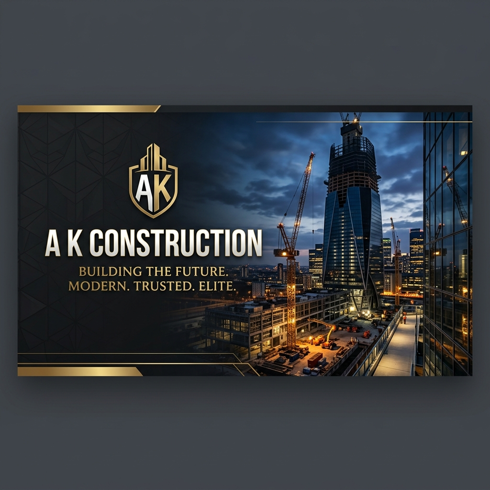
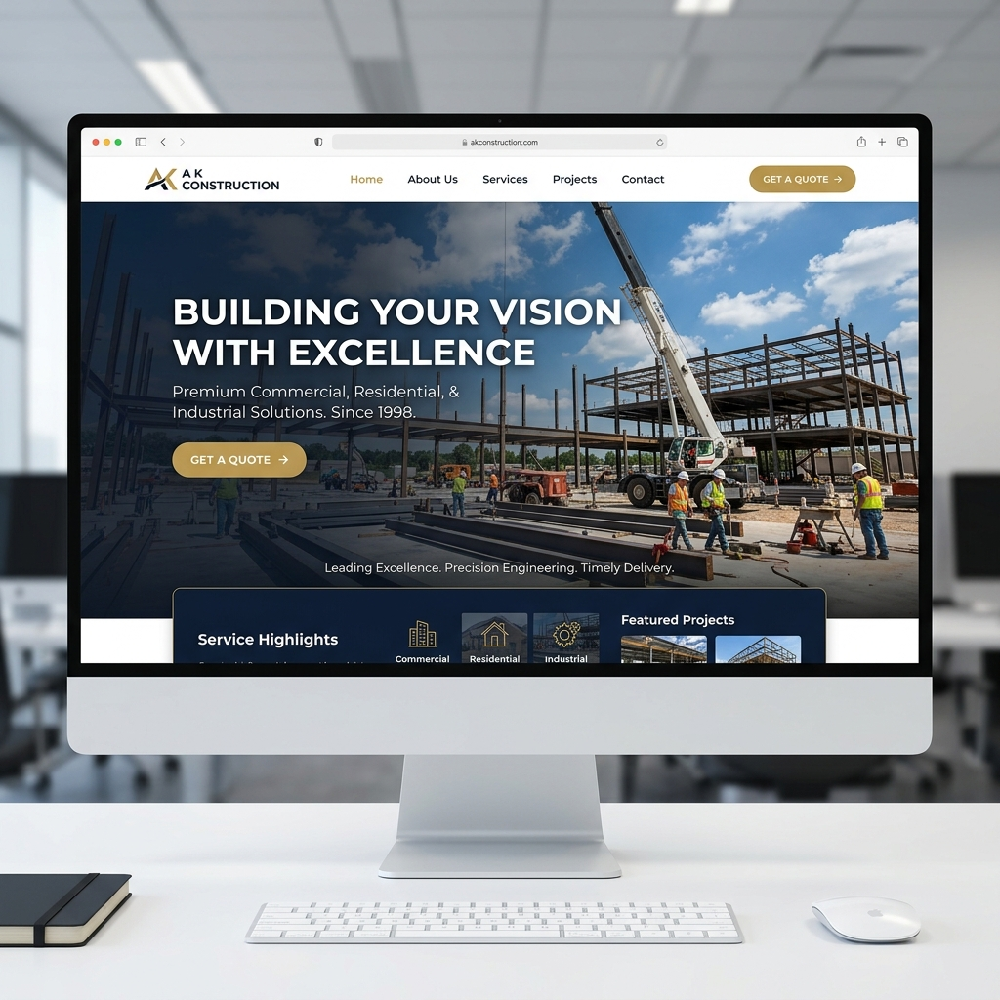

# 🏗️ A K Construction - Professional Construction Website

[](https://spring.io/projects/spring-boot)
[](https://www.oracle.com/java/)
[](https://www.mysql.com/)
[](https://opensource.org/licenses/MIT)

A K Construction is a premium, high-performance web application designed for a modern construction company. Built with the Spring Boot framework, it offers a seamless user experience, responsive design, and robust backend management for services and projects.



## 🌟 Key Features

-   **💎 Modern UI/UX:** Sleek, professional design with a premium aesthetic using CSS3 and JavaScript.
-   **📱 Fully Responsive:** Optimized for all devices, including desktops, tablets, and mobile phones.
-   **🏢 Project Showcase:** Detailed gallery and descriptions of completed and ongoing construction projects.
-   **🛠️ Service Overview:** Comprehensive list of services offered, from residential to commercial construction.
-   **📧 Interactive Contact Form:** Seamless communication channel with built-in validation and database integration.
-   **⚡ Fast & Secure:** Built on Spring Boot for high performance and standard security practices.

## 🚀 Tech Stack

-   **Backend:** Java 8, Spring Boot 2.7.18, Spring MVC
-   **Data Access:** Spring JDBC
-   **Database:** MySQL 8.0
-   **Frontend:** JSP (JavaServer Pages), JSTL, CSS3, JavaScript
-   **Build Tool:** Maven
-   **Server:** Embedded Tomcat

## 📸 Preview



## 🛠️ Getting Started

Follow these steps to set up the project locally.

### Prerequisites

-   **Java JDK 8** or higher
-   **Maven 3.6+**
-   **MySQL Server 8.0+**

### Installation & Setup

1.  **Clone the Repository**
    ```bash
    git clone https://github.com/Yashparmar29/A-K-Construction-.git
    cd A-K-Construction-
    ```

2.  **Database Configuration**
    -   Create a database named `ak_construction` in MySQL.
    -   Import the SQL schema from `database/ak_construction.sql`.
    -   Update `src/main/resources/application.properties` with your MySQL credentials:
        ```properties
        spring.datasource.username=your_username
        spring.datasource.password=your_password
        ```

3.  **Build the Project**
    ```bash
    mvn clean install
    ```

4.  **Run the Application**
    ```bash
    mvn spring-boot:run
    ```
    Or use the provided `run.bat` file on Windows.

5.  **Access the Website**
    Open your browser and navigate to: `http://localhost:8080`

## 📂 Project Structure

```text
A-K-Construction-/
├── src/main/java/          # Java Source Code (Controllers, Models, Repositories)
├── src/main/resources/     # Configuration & Static Assets
├── src/main/webapp/        # JSP Views, CSS, and JS files
├── database/               # SQL Schema Scripts
├── docs/images/            # README Assets (Banners, Mockups)
└── pom.xml                 # Maven Dependencies
```

## 🤝 Contributing

Contributions are welcome! If you'd like to improve the project, please:
1.  Fork the repository.
2.  Create your feature branch (`git checkout -b feature/AmazingFeature`).
3.  Commit your changes (`git commit -m 'Add some AmazingFeature'`).
4.  Push to the branch (`git push origin feature/AmazingFeature`).
5.  Open a Pull Request.

## 📜 License

This project is licensed under the MIT License - see the [LICENSE](LICENSE) file for details.

## 📞 Contact

**Yash Parmar**  
GitHub: [@Yashparmar29](https://github.com/Yashparmar29)  
Project Link: [https://github.com/Yashparmar29/A-K-Construction-](https://github.com/Yashparmar29/A-K-Construction-)

---
*Built with ❤️ for the Construction Industry.*
